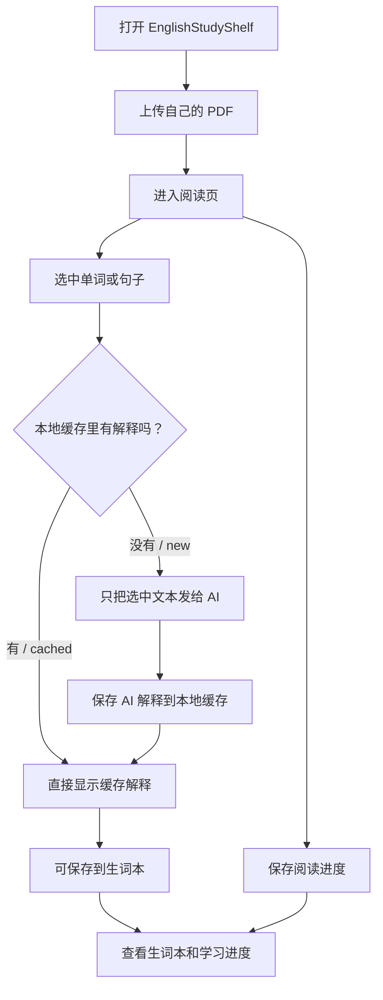
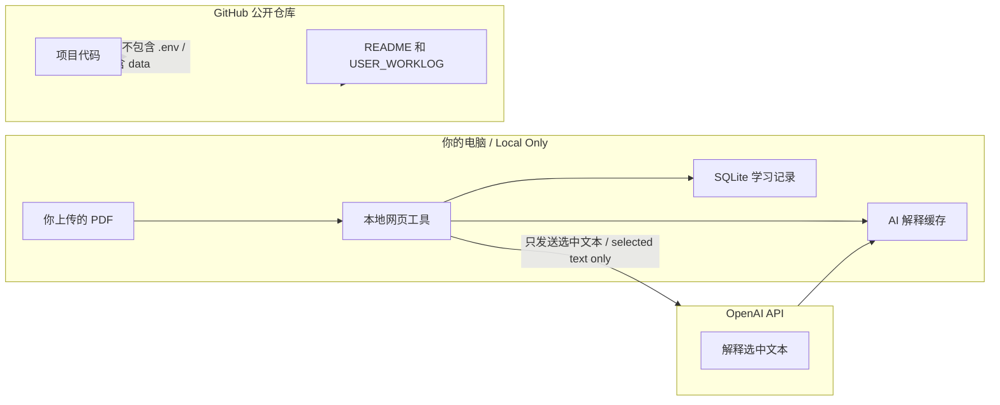
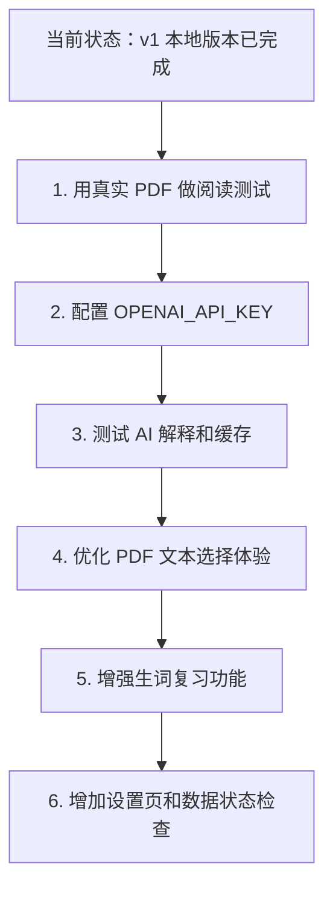

# 给用户看的项目记录 / User Worklog

这个文件是给你看的，不是给 Codex 做内部规划用的。  
Codex 自己用的三个文件还是：

- `task_plan.md`：详细计划和阶段
- `progress.md`：细碎工作流水
- `findings.md`：发现、约束、架构备注

这里会用更直白的中文，把项目状态说清楚。

## 项目是什么

`EnglishStudyShelf` 是一个本地英语 PDF 学习工具。

第一版目标：

- 上传你自己的 PDF
- 在本地网页里阅读 PDF
- 选中单词或句子后，让 AI 解释
- 保存生词
- 查看学习进度
- AI 解释结果本地缓存，避免重复花 token

## 重要边界

- 仓库公开的是代码，不公开书籍资源。
- 不内置教材 PDF。
- 不上传 `.env`。
- 不上传你本地的 `data/` 数据库和 PDF。
- AI 请求只发送你选中的内容，不默认发送整本书。
- 第一版不做登录。
- 第一版不做公开网站，只做本地可运行版本。

## 当前已经完成

- 搭好了本地全栈项目结构：
  - `apps/web`：网页前端
  - `apps/api`：本地 API
  - `packages/shared`：共享类型
- 做了书架页面。
- 做了 PDF 上传。
- 做了 PDF 阅读页。
- 做了选中文本后 AI 解释。
- 做了生词本。
- 做了学习进度展示。
- 做了 AI 解释本地缓存。
- 做了 Windows 一键启动脚本：`start-english-study-shelf.cmd`。
- 把文案改成中英混合，适合英语学习场景。
- 上传到了 GitHub：
  - `https://github.com/a13622349460-png/EnglishStudyShelf`

## 怎么运行

最简单方式：

1. 打开项目文件夹。
2. 双击 `start-english-study-shelf.cmd`。
3. 保持弹出的窗口不要关闭。
4. 浏览器会自动打开本地网页。

如果要手动运行：

```powershell
npm.cmd install
Copy-Item .env.example .env
npm.cmd run dev
```

如果要用真实 AI 解释，需要把 OpenAI API Key 填到本地 `.env`：

```text
OPENAI_API_KEY=你的 key
```

`.env` 不会上传到 GitHub。

## 已经验证过

这些命令已经跑通过：

```powershell
npm.cmd run check
npm.cmd run build
```

也短暂验证过本地启动：

- API 默认在 `http://localhost:3333`
- 网页一般在 `http://localhost:5173`
- 如果 `5173` 被占用，Vite 可能会换到 `5174`

## GitHub 状态

仓库地址：

`https://github.com/a13622349460-png/EnglishStudyShelf`

已经推送过的关键提交：

- `0a19de0`：初始项目
- `5ce8001`：记录 GitHub 上传
- `bcb90cf`：改成中英混合文案
- `e8a81fb`：保存 planning 工作日志

## 本地不要上传的东西

这些都已经在 `.gitignore` 里：

- `.env`
- `data/`
- `node_modules/`
- 构建产物 `dist/`
- 日志文件
- SQLite 数据库
- PDF 文件

也就是说，你自己上传的书和学习记录默认只在本机。

## 接下来可以做什么

建议下一步：

1. 用真实 PDF 测一下阅读体验。
2. 配置 `.env` 里的 `OPENAI_API_KEY`，测试 AI 解释。
3. 优化 PDF 文本选择体验。
4. 给生词本加复习功能，比如熟悉度、复习次数、导出。
5. 给学习进度做更细的图表。
6. 做一个更友好的设置页，用来检查 API Key、本地数据目录、缓存状态。

## 怎么看详细记录

如果你想看更细的流水账：

- `progress.md`：最完整的工作日志
- `task_plan.md`：阶段计划和错误记录
- `findings.md`：项目发现和架构备注

但日常只看这个 `USER_WORKLOG.md` 就够了。

## 图表速览

下面这些图是给你快速理解项目用的。  
在 GitHub 页面里，`mermaid` 图会自动渲染成可视化图表。

### 项目结构树

```text
EnglishStudyShelf
├─ apps
│  ├─ web                  网页前端 / React + Vite
│  │  ├─ 书架 Books
│  │  ├─ PDF 阅读 Reader
│  │  ├─ AI 解释 Explain
│  │  └─ 生词本 Words
│  └─ api                  本地后端 / Express + SQLite
│     ├─ PDF 上传 Upload
│     ├─ 阅读进度 Progress
│     ├─ 生词本 Vocabulary
│     └─ AI 缓存 Cache
├─ packages
│  └─ shared               前后端共享类型
├─ data                    本地数据，不上传 GitHub
│  ├─ books                用户自己的 PDF
│  └─ english-study-shelf.sqlite
├─ start-english-study-shelf.cmd
├─ README.md
└─ USER_WORKLOG.md         给用户看的记录
```

### 使用流程图



### 数据安全边界图



### 下一步计划图


